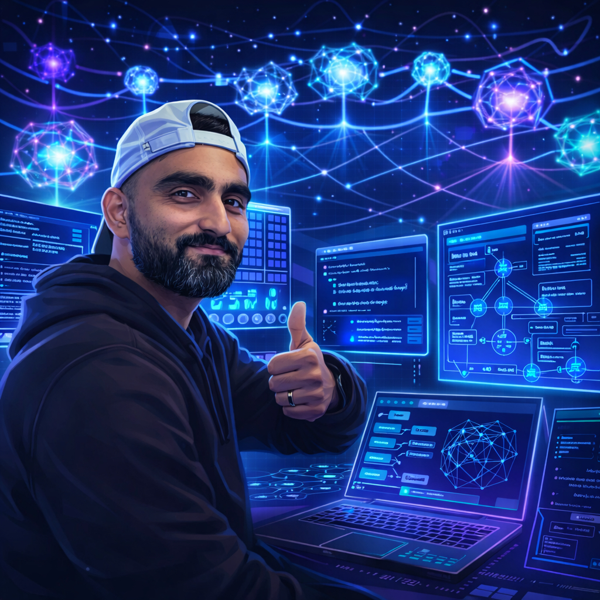

# Hi, I'm Aviral 👋



**Software Engineer at Microsoft** · Building the infrastructure that makes AI agents production-ready.

I work on AI agent orchestration, multi-agent systems, and the [A2A protocol](https://github.com/google-a2a/A2A) — designing the orchestration, observability, and safety layers that multi-agent workflows need. My open-source projects span the full stack, from protocol implementation to adversarial testing.

---

### 🏗️ The Multi-Agent Stack

```
SAFETY & EVAL          agent-traps-lab · agent-shield
KNOWLEDGE & RETRIEVAL  rag-a2a · wiki-recall · wiki-vs-rag
OBSERVABILITY          ag-ui-crews · ventureos
ORCHESTRATION          a2a-crews · agent-teams
```

### 🔬 Featured Projects

**Orchestration & Protocols**
- [**a2a-crews**](https://github.com/aviraldua93/a2a-crews) — Turn one command into a team of AI agents. Built on Google's A2A protocol.
- [**ag-ui-crews**](https://github.com/aviraldua93/ag-ui-crews) — Real-time dashboard for `a2a-crews`, built on the AG-UI protocol. Watch your crews plan, execute, and deliver in a live web UI.
- [**ventureos**](https://github.com/aviraldua93/ventureos) — Mission Control for AI agent teams: a real-time dashboard to watch your agents think, talk, code, and ship.
- [**agent-teams**](https://github.com/aviraldua93/agent-teams) — Turn one Copilot CLI into a team of parallel AI specialists.

**Knowledge & Retrieval**
- [**rag-a2a**](https://github.com/aviraldua93/rag-a2a) — Production-grade RAG pipeline exposed as an A2A agent. Hybrid search, reranking, evaluation, and streaming.
- [**wiki-recall**](https://github.com/aviraldua93/wiki-recall) — Compiled knowledge meets layered recall. Karpathy wiki + MemPalace memory layers in a 5-layer architecture.
- [**wiki-vs-rag**](https://github.com/aviraldua93/wiki-vs-rag) — Head-to-head benchmark: RAG vs Karpathy-style LLM wiki knowledge compilation. Built with the A2A protocol.
- [**devcontext**](https://github.com/aviraldua93/devcontext) — Portable AI-driven working scenarios — Docker for your engineering brain. Resume any project, on any machine, instantly.

**Safety & Evaluation**
- [**agent-traps-lab**](https://github.com/aviraldua93/agent-traps-lab) — Empirical testbed for DeepMind's *AI Agent Traps* paper: 22 adversarial scenarios across 4 models.
- [**agent-shield**](https://github.com/aviraldua93/agent-shield) — Runtime security gateway for multi-agent systems: policy enforcement, PII filtering, scope limits, and approval gates.

**Tooling**
- [**architect-ai**](https://github.com/aviraldua93/architect-ai) — AI-powered study tool for the Claude Certified Architect exam. The codebase *is* the curriculum.
- [**gstack-copilot**](https://github.com/aviraldua93/gstack-copilot) — Garry Tan's `gstack` engineering workflow ported to the GitHub Copilot CLI.

### 🧰 Working With


### 🔗 Connect

- 💼 [LinkedIn](https://www.linkedin.com/in/aviraldua)
- 📧 aviral.dua93@gmail.com
